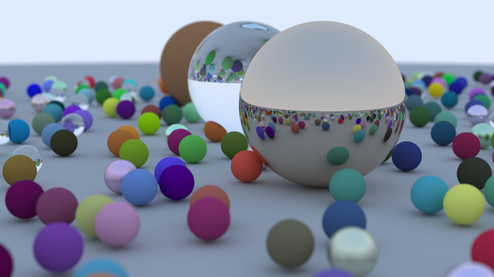

# C++26 Raytracer: One Weekend

A high-performance raytracer following the *Ray Tracing in One Weekend* series, modernized for **C++26**.

## Current Status: Chapter 5 (Surface Normals)
The engine can now intersect spheres and calculate surface normals to provide 3D shading.

## Modern Improvements
While following the textbook, this implementation introduces several "2026-era" C++ optimizations:

* **Binary P6 Output:** Switched from ASCII (P3) to Binary (P6) for significantly faster file I/O and smaller file sizes.
* **Performance:** Uses `std::vector` pre-allocation and `std::chrono` for high-precision profiling (Current render: ~3ms).
* **C++26 Features:** Extensive use of `constexpr` for compile-time math, `std::print` for modern logging, and `std::formatter` specializations for `vec3`.
* **Safety:** Integrated `std::clamp` for color safety and `[[nodiscard]]` attributes to catch logic errors during compilation.
