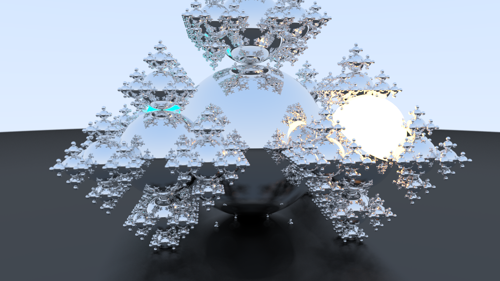
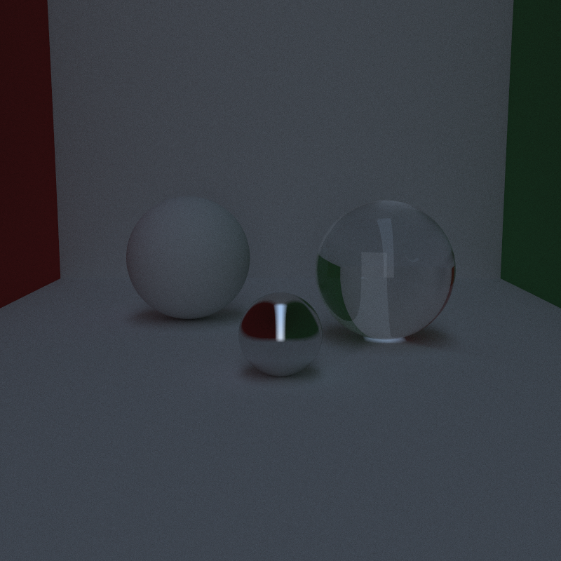
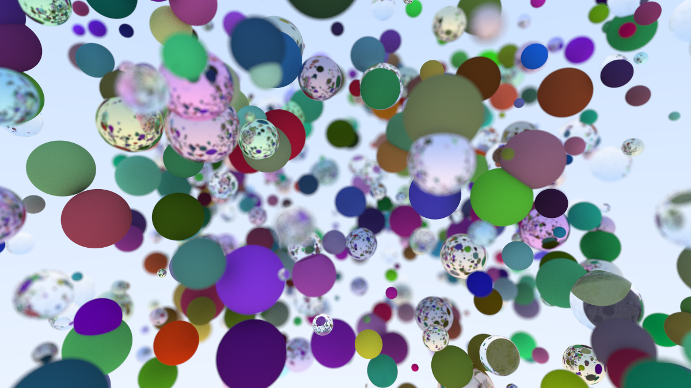
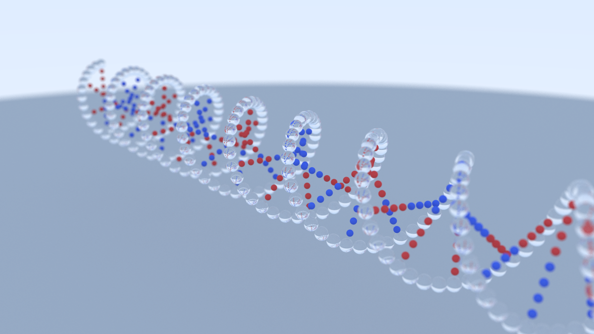
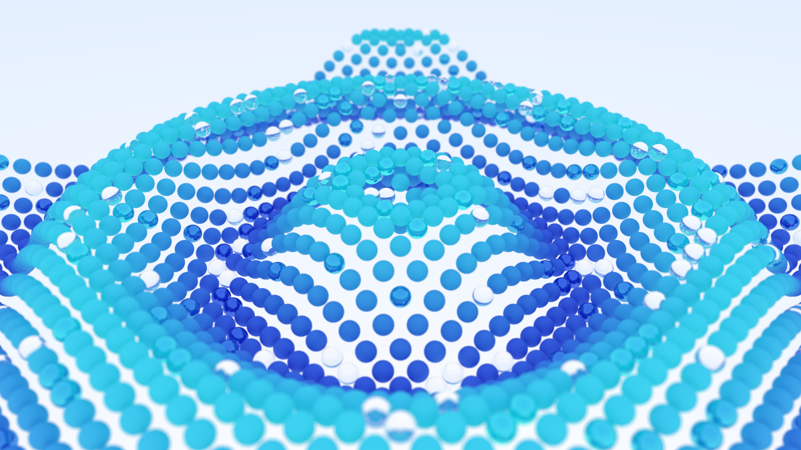
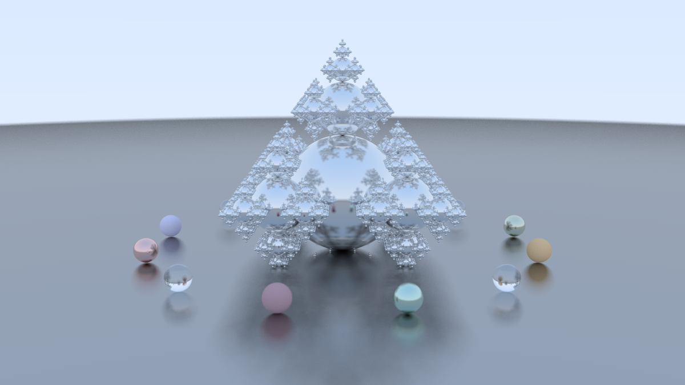

# C++26 Raytracer: One Weekend & Beyond

<p align="center">
  
  <br>
  <i>Example scene rendered with our engine.</i>
</p>

A high-performance, physically-based raytracer built with a focus on modern C++ standards, extreme optimization, and clean architecture. Follows Peter Shirley's [_Ray Tracing in One Weekend_](https://raytracing.github.io/books/RayTracingInOneWeekend.html) with restructured code, new features and significant performance enhancements.

## Key Improvements

* **Parallelization:** Divides the image into 16x16 pixel tiles and renders them in parallel using C++'s `<execution>` library and TBB, significantly speeding up rendering times on multi-core processors (up to **15x faster** in 8-core testing).

* **SIMD-Ready:** Our `vec3` implementation is `alignas(16)` to ensure it fits perfectly into SSE/AVX registers, processing math operations across x, y, and z coordinates simultaneously.

* **BVH Acceleration:** Implements Bounding Volume Hierarchy (BVH) to reduce the amount of ray-object intersection tests from $O(N)$ to $O(\log N)$, allowing for thousands of objects in scenes with minimal performance degradation (later introduced in [Book 2](https://raytracing.github.io/books/RayTracingTheNextWeek.html)).

## Benchmarks

Our benchmark render is the book cover from *Ray Tracing in One Weekend*, featuring a large number of spheres with various materials and lighting conditions.

| Metric | Original (Book 1 Baseline) | This Engine | Speedup |
| :--- | :--- | :--- | :--- |
| **Render Time (Book Cover)** | ~58 Minutes | **233.04 Seconds** | **~15x Faster** |
| **Complexity** | $O(N)$ | $O(\log N)$ | — |
| **Concurrency** | Single-Threaded | **Parallel (8 CPU Cores)** | — |

<p align="center">
  
  <br>
  <i>Render used for benchmarking.</i>
</p>

## New features

* **Modern C++ Standards:** Utilizes C++20/26 features for improved performance, safety, and readability.

* **Emissive materials (Lights):** Added a new emissive material type to simulate light sources (later introduced in [Book 2](https://raytracing.github.io/books/RayTracingTheNextWeek.html)).

* **Performance Logging:** Implemented a logging system for debugging and performance monitoring.

* **Header-Only Scene System:** Scenes to be rendered are defined in header files, allowing for easy swapping and testing of different scenes without modifying core engine code.


## Build Instructions

### Prerequisites

* Compiler: C++26 compatible compiler (GCC 14+ or Clang 18+).
* Libraries: Intel TBB (Threading Building Blocks) for parallel execution.

### Building

1. Clone the repository:
   ```bash
   git clone https://github.com/doopees/raytracer
   cd raytracer
   ```
2. Build the project:
   ```bash
   g++ -O3 -ffast-math -march=native -std=c++2c \
   -fpeel-loops -fvect-cost-model=unlimited \
   main.cpp src/*.cpp -o raytracer \
   -ltbb12 -lstdc++exp
   ```
   *If your system uses a different TBB version, you may need to change `-ltbb12` to `-ltbb`.*


## Usage

Defining a scene is as simple as creating a header file:

**`scenes/example.h`**
```cpp
#pragma once
#include "../src/scene.h"

inline scene generate_scene() {
    hittable_list world;
    auto mat = std::make_shared<lambertian>(color(0.5, 0.5, 0.5));
    world.add(std::make_shared<sphere>(point3(0,0,0), 0.5, mat));

    camera cam;
    cam.aspect_ratio = 16.0 / 9.0;
    cam.image_width  = 400;
    cam.lookfrom     = point3(0,0,3);
    cam.lookat       = point3(0,0,0);
    
    return {world, cam};
}
```

Next, rendering is done in **`main.cpp`**:
```cpp
#include "scenes/example.h"

int main() {
    auto [world, cam] = generate_scene();
    cam.render(world, "example.png");
    return 0;
}
```

## Showcase

### [cornell_box.h](scenes/cornell_box.h)

*Classic test for indirect lighting and color bleeding.*

### [bokeh.h](scenes/bokeh.h)


### [dna.h](scenes/dna.h)


### [light.h](scenes/light.h)


### [wave.h](scenes/wave.h)


### [snowflake.h](scenes/snowflake.h)


## References

* “Ray Tracing in One Weekend.” [raytracing.github.io/books/RayTracingInOneWeekend.html](https://raytracing.github.io/books/RayTracingInOneWeekend.html)
(accessed 01. 22, 2026)
